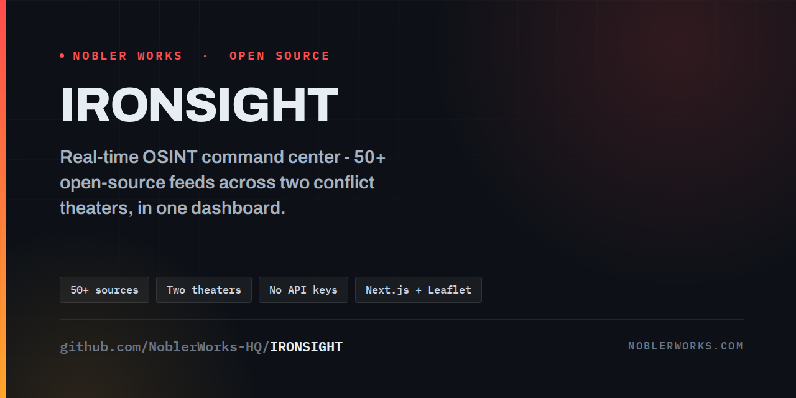
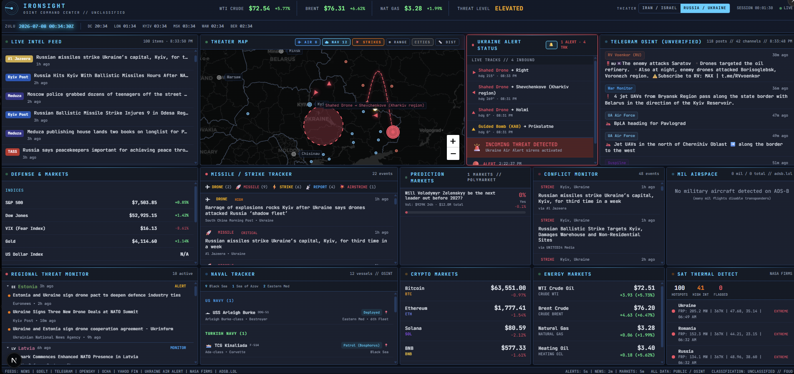

<div align="center">



# 🛰️ ConflictLens

### Real-time OSINT command center for monitoring active conflicts

One dashboard. Two theaters. 50+ free open-source feeds. **No API keys required.**

[](https://nextjs.org/)
[](https://www.typescriptlang.org/)
[](https://tailwindcss.com/)
[](https://leafletjs.com/)
[](#-run-with-docker)

[](LICENSE)
[](https://github.com/Syed-Muhammad-Tayyab/ConflictLens/stargazers)
[](https://github.com/Syed-Muhammad-Tayyab/ConflictLens/network/members)
[](https://github.com/Syed-Muhammad-Tayyab/ConflictLens/issues)
[](https://github.com/Syed-Muhammad-Tayyab/ConflictLens/actions)
[](https://github.com/Syed-Muhammad-Tayyab/ConflictLens/commits/main)

[Features](#-features) • [Screenshot](#-screenshot) • [Quick Start](#-quick-start) • [Docker](#-run-with-docker) • [Data Sources](#-data-sources) • [Architecture](#-architecture) • [Credits](#-credits--attribution)

</div>

---

## 📖 About

**ConflictLens** is a real-time OSINT (open-source intelligence) dashboard that aggregates news, Telegram channels, military air and naval tracking, financial markets, prediction markets, satellite thermal data, and live air-raid alert feeds into a single screen.

A **theater toggle** in the header flips the whole dashboard between:

| Theater | Region |
|---|---|
| 🇮🇱 / 🇮🇷 **Iran / Israel** | Middle East *(default)* |
| 🇺🇦 / 🇷🇺 **Russia / Ukraine** | Eastern Europe |

Every panel, map layer, and data feed re-points to the selected conflict, and your choice is remembered across reloads.

> **No database. No backend. No API keys. Free to run.** Upstream feeds are proxied through Next.js API routes.

> ⚠️ ConflictLens does not own or generate any of the underlying data. It is a *viewer* of publicly available third-party feeds, all credited to their providers. See [Credits & Attribution](#-credits--attribution) and the [Legal Disclaimer](#-legal-disclaimer).

---

## 🖼️ Screenshot

<div align="center">



*Russia / Ukraine theater view. Panels are live and update on their own polling intervals.*

</div>

---

## ✨ Features

| | Feature | Description |
|---|---|---|
| 🔀 | **Conflict Toggle** | Switch the whole dashboard between two theaters; selection persists in the browser |
| 📰 | **Live Intel Feed** | Per-theater RSS aggregation with relevance filtering and sports/entertainment noise removal |
| 📡 | **Telegram OSINT** | Public channels scraped in real time with auto-translation (Hebrew/Arabic/Farsi and Ukrainian/Russian) |
| 🗺️ | **Theater Map** | Leaflet map with military aircraft, naval vessels, strike markers, missile arcs, range rings, borders, and a distance tool |
| 🚁 | **Drone / Missile Tracker** *(Russia/Ukraine)* | Shahed drones, cruise/ballistic missiles, and KAB glide bombs with heading, trails, and confidence |
| 🚨 | **Air-Raid Alerts** | Israeli Home Front Command sirens and Ukrainian oblast alerts, with audio notifications and on-map sirens |
| 🎯 | **Missile / Strike Tracker** | Weapon-type classification and severity scoring |
| 🌍 | **Regional Threat Monitor** | Per-country threat levels across the theater's neighbors |
| ✈️ | **Military Airspace** | Live military aircraft via adsb.lol, filtered per theater |
| 🚢 | **Naval Tracker** | Known vessel positions (Gulf / Red Sea / Eastern Med, or Black Sea / Sea of Azov) |
| 📈 | **Defense & Markets** | Defense stocks, indices, VIX, gold, USD (Yahoo Finance) |
| ₿ | **Crypto Markets** | Bitcoin, Ethereum, Solana, BNB with 24h change |
| 🎲 | **Prediction Markets** | Live Polymarket odds relevant to the selected conflict |
| 🛢️ | **Energy Markets** | WTI, Brent, natural gas, heating oil, gasoline |
| 🔥 | **Satellite Thermal Detect** | NASA FIRMS fire/explosion detection, per theater |
| 📋 | **Conflict Monitor** | Categorized events (strikes, defense, diplomatic, nuclear) with per-theater geocoding |

---

## 🚀 Quick Start

**Prerequisite:** Node.js 22 (see [`.nvmrc`](.nvmrc); run `nvm use` if you use nvm). No environment variables needed.

```bash
# 1. Clone
git clone https://github.com/Syed-Muhammad-Tayyab/ConflictLens.git
cd ConflictLens

# 2. Install
npm install        # or: npm ci

# 3. Run
npm run dev
```

Open **http://localhost:3000** and use the **THEATER** toggle in the header.

### Production build

```bash
npm run build
npm start
```

### Tests

```bash
npm test
```

---

## 🐳 Run with Docker

A multi-stage `Dockerfile` produces a slim standalone image that runs as a non-root user. No API keys or env vars needed.

```bash
docker compose up --build
```

Then open **http://localhost:3000**. Stop with `Ctrl+C` (or `docker compose down`).

Without Compose:

```bash
docker build -t conflictlens .
docker run --rm -p 3000:3000 conflictlens
```

To use another host port, map it (for example `-p 8080:3000`) or edit `ports` in `docker-compose.yml`.

---

## 🧰 Tech Stack

| Layer | Technology |
|---|---|
| Framework | Next.js 16 (App Router) |
| Language | TypeScript |
| Styling | Tailwind CSS |
| Maps | Leaflet / React-Leaflet |
| XML parsing | @xmldom/xmldom |
| Container | Docker (multi-stage, standalone output) |
| CI | GitHub Actions (typecheck, tests, build) |

---

## 🏗️ Architecture

```
ConflictLens/
├── assets/                  # README images
├── public/
├── src/
│   ├── app/
│   │   ├── api/             # one route per upstream feed (alerts, drones, flights, news, ...)
│   │   ├── layout.tsx
│   │   └── page.tsx         # dashboard layout
│   ├── components/
│   │   ├── map/             # ConflictMap (Leaflet)
│   │   └── panels/          # one panel per data feed
│   ├── data/                # static city data
│   ├── lib/
│   │   └── conflicts/       # one config object per theater
│   └── types/
├── tests/                   # escape / XSS regression tests
├── Dockerfile
└── docker-compose.yml
```

Each conflict is a config object under `src/lib/conflicts/` describing everything theater-specific: map center and cities, keywords, RSS feeds, Telegram channels, alert provider, bounding boxes. A React context (`useConflict`) exposes the active conflict to the UI, and a `useConflictFeed` hook appends the selected conflict to every API request so routes serve the right theater.

**Adding a new conflict** is mostly a matter of adding a config file and registering it in `src/lib/conflicts/index.ts`.

---

## 📡 Data Sources

**All data comes from free, publicly accessible endpoints and requires no API keys.** None of it is owned by this project.

### Live APIs & feeds

| Service | Data | Provider | Cost |
|---------|------|----------|------|
| Yahoo Finance | Stocks, indices, commodities, oil futures | Yahoo | Free, no key |
| CoinGecko | Cryptocurrency prices | CoinGecko | Free, no key |
| Polymarket | Prediction-market odds | Polymarket (Gamma API) | Free, no key |
| NASA FIRMS | Fire / thermal-anomaly satellite data | NASA | Free, no key |
| adsb.lol | Military aircraft ADS-B tracking | Community ADS-B network | Free, no key |
| Tzeva Adom | Israeli missile/rocket/drone alerts | Community mirror of Pikud HaOref | Free, no key |
| alerts.com.ua | Ukrainian oblast air-raid alerts | alerts.com.ua | Free, no key |
| Neptun | Ukraine drone/missile/KAB tracks | neptun.in.ua | Free, no key |
| Google News RSS | Keyword/location-scoped news | Google | Free, no key |
| Google Translate | Hebrew/Arabic/Farsi + Ukrainian/Russian translation | Google (unofficial) | Free, no key |
| Telegram | Public channel posts via embed scraping | Telegram | Free, no key |

### Map

| Layer | Provider | License |
|-------|----------|---------|
| Dark basemap tiles | [CARTO](https://carto.com/) Dark Matter, data © [OpenStreetMap](https://www.openstreetmap.org/copyright) contributors | ODbL / CARTO attribution |
| Country borders | [Natural Earth](https://www.naturalearthdata.com/) `ne_50m_admin_0_boundary_lines_land` | Public domain |
| Map engine | [Leaflet](https://leafletjs.com/) | BSD-2-Clause |

<details>
<summary><strong>📰 News RSS feeds: Iran / Israel</strong></summary>

BBC Middle East, New York Times Middle East, Al Jazeera, Reuters World, CNN Middle East, Fox News World, Wall Street Journal, Times of Israel, Jerusalem Post, Ynet News, N12 (Mako), Walla News, Haaretz, PressTV (Iran), The National (UAE/GCC), Drop Site News, Breaking Defense, Long War Journal, Military Times, War on the Rocks, CENTCOM, U.S. DoD, and conflict-scoped Google News searches.
</details>

<details>
<summary><strong>📰 News RSS feeds: Russia / Ukraine</strong></summary>

BBC Europe, New York Times Europe, Al Jazeera, Reuters World, Fox News World, Wall Street Journal, Kyiv Independent, Ukrainska Pravda (EN), Kyiv Post, The New Voice of Ukraine (NV), Ukrinform, TASS, RT, The Moscow Times, Meduza (EN), Breaking Defense, Military Times, War on the Rocks, U.S. DoD, and war-scoped Google News searches.
</details>

<details>
<summary><strong>📡 Telegram channels: Iran / Israel</strong></summary>

IDF Official, Rocket Alert, Alert Israel, Times of Israel, Abu Ali Express, OSINT Defender, Warfare Analysis, RN Intel, GeoPol Watch, ME Spectator, Hamas-Israel War, PressTV, Iran International, Fars News, Tasnim News, Saberin (IRGC), DefaPress (Iran MOD), IRGC Official, Fotros Resistance, Quds News, Al-Saa EN, The Cradle, Drop Site News, France 24, WAM (UAE), Gulf News (UAE), Ali Bk, Al Jazeera, Bint Jbeil, Kian Meli (Iran).
</details>

<details>
<summary><strong>📡 Telegram channels: Russia / Ukraine</strong></summary>

**Ukrainian official / military:** UA General Staff, UA Air Force (kpszsu), Zelensky Official, Operatyvno ZSU, Ukraine NOW.

**Ukrainian outlets:** Kyiv Independent, Ukrainska Pravda, UNIAN, Suspilne, Trukha UA, NEXTA, Insider UA, BBC Ukraine, Radio Svoboda.

**Ukrainian journalists / independents:** Yuriy Butusov, Serhii Sternenko, Serhii Flash, Lachen, Anton Gerashchenko (EN), Tsaplienko, Motolko (Belarus).

**Russian state / war correspondents:** RIA Novosti, Russian MoD, Readovka, WarGonzo, RV Voenkor, Poddubny, Colonel Cassad, Grey Zone, Two Majors, Kots, Kotenok.

**Independent Russian journalists / outlets:** Meduza, Astra, Mediazona, Agentstvo, Holod, Maxim Katz.

**OSINT aggregators:** OSINT Defender, War Monitor, DeepState UA, Rybar.
</details>

### ⏱️ Polling intervals

| Feed | Interval |
|------|----------|
| Air-raid alerts (Pikud HaOref / alerts.com.ua) | 15 seconds |
| Drone / missile tracker (Neptun) | 20 seconds |
| Telegram channels | 60 seconds |
| Regional threat monitor | 60 seconds |
| News RSS | 90 seconds |
| Strikes | 2 minutes |
| Conflicts / Flights | 3 minutes |
| Naval | 5 minutes |
| Markets, Oil, Crypto & Polymarket | 10 minutes |
| Fires (NASA FIRMS) | 10 minutes |

---

## 🗺️ Roadmap

- [ ] Memoize the Telegram scraper response and cache negative probes to cut upstream requests
- [ ] Split `ConflictMap.tsx` into one hook per feed layer
- [ ] Share API response types between routes and panels (`src/lib/types/`)
- [ ] Migrate to Tailwind CSS 4 and an ESLint flat config
- [ ] Add more theaters (the config-per-conflict design makes this easy)

---

## 🤝 Contributing

Contributions are welcome.

1. Fork the repo
2. Create a branch: `git checkout -b feature/my-feature`
3. Commit: `git commit -m "Add my feature"`
4. Push: `git push origin feature/my-feature`
5. Open a Pull Request

Please run `npm test` and `npm run build` before submitting.

---

## 🙏 Credits & Attribution

**ConflictLens is based on [IRONSIGHT](https://github.com/NoblerWorks-HQ/IRONSIGHT) by [Nobler Works](https://noblerworks.com/)**, released under the MIT License. The original copyright notice is preserved in [`LICENSE`](LICENSE). Modifications and rebranding by [Syed Muhammad Tayyab](https://github.com/Syed-Muhammad-Tayyab).

ConflictLens is also a **viewer**, not a data owner. Every feed, dataset, headline, alert, track, tile, and post surfaced here belongs to its respective provider, and we claim **no ownership or credit** for any of it:

- **News:** the news organizations and wire services listed above, via public RSS feeds
- **Air-raid alerts:** [Pikud HaOref](https://www.oref.org.il/) via the Tzeva Adom community mirror; Ukrainian alerts via [alerts.com.ua](https://alerts.com.ua/)
- **Drone / missile tracking:** [Neptun](https://neptun.in.ua/)
- **Aircraft:** [adsb.lol](https://www.adsb.lol)
- **Satellite thermal:** [NASA FIRMS](https://firms.modaps.eosdis.nasa.gov/)
- **Markets / energy:** Yahoo Finance; **crypto:** [CoinGecko](https://www.coingecko.com/); **prediction markets:** [Polymarket](https://polymarket.com/)
- **Maps:** [Leaflet](https://leafletjs.com/), basemap by [CARTO](https://carto.com/) with data © [OpenStreetMap](https://www.openstreetmap.org/copyright) contributors, borders from [Natural Earth](https://www.naturalearthdata.com/)
- **Translation:** Google Translate (unofficial endpoint)
- **Social OSINT:** public Telegram channels, owned by their respective operators

If you are a provider listed here and would like your source removed or its attribution changed, please [open an issue](https://github.com/Syed-Muhammad-Tayyab/ConflictLens/issues).

---

## ⚖️ Legal Disclaimer

**Purpose and scope.** This project is provided strictly for **educational and research purposes**. It demonstrates techniques for aggregating publicly available OSINT using modern web technologies. It is not intended for commercial use, resale of data, or any activity that violates applicable laws or third-party terms of service.

**Data sources.** All data is sourced from publicly accessible endpoints. No paywalls are bypassed, no authentication is circumvented, and no copyrighted content is reproduced in full. Only headlines, links, and public metadata are displayed.

**Unofficial endpoints.** Some sources rely on unofficial or undocumented endpoints (Yahoo Finance chart data, Google Translate, Telegram embeds, Google News RSS, community alert/tracking feeds). These:

- Are not officially supported APIs and may violate the provider's Terms of Service
- May stop working, change, or be blocked without notice
- Are used here solely for non-commercial educational demonstration
- Should be replaced with official APIs for any commercial or production use

**Third-party content.** News, Telegram posts, financial data, alerts, drone/missile tracks, map tiles, and all other third-party content belong to their respective publishers and providers. Market data may carry additional redistribution restrictions from upstream licensors.

**User responsibility.** By using this software you agree that:

- You are solely responsible for ensuring your use complies with all applicable laws and third-party terms in your jurisdiction
- The authors and contributors are not liable for misuse, TOS violations, legal claims, or damages arising from use of this software
- You will not use it for commercial data redistribution, automated trading, or any purpose that violates the underlying providers' terms
- The software is provided **"as is"**, without warranty of any kind

**ADS-B attribution.** Military aircraft data is provided by [adsb.lol](https://www.adsb.lol) under the [ODbL 1.0](https://opendatacommons.org/licenses/odbl/1-0/).

**Map attribution.** Tiles © [CARTO](https://carto.com/attribution), data © [OpenStreetMap](https://www.openstreetmap.org/copyright) contributors. Borders from [Natural Earth](https://www.naturalearthdata.com/) (public domain).

**No endorsement.** This project is not affiliated with, endorsed by, or sponsored by any data provider, news organization, government, or military entity whose data it aggregates.

---

## 📄 License

Released under the [MIT License](LICENSE). Original work © Nobler Works; modifications © Syed Muhammad Tayyab.

---

<div align="center">

### 👨‍💻 Maintainer

**Syed Muhammad Tayyab**
BSCS (Information Security) • Full-Stack Developer • Islamabad, Pakistan

[](https://github.com/Syed-Muhammad-Tayyab)

⭐ If you find this project useful, consider giving it a star!

</div>
